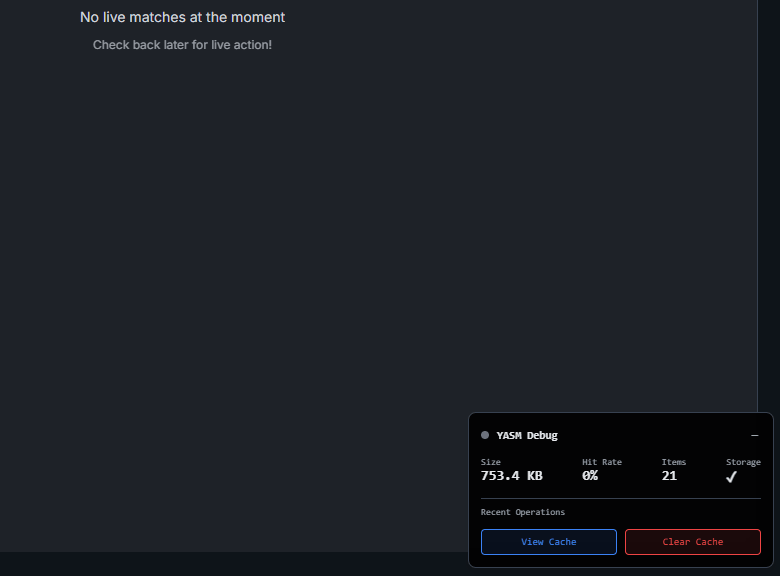

# YASM - Yet Another State Manager

YASM is a lightweight state management library that simplifies data fetching and caching, with no external dependencies.

[](https://www.npmjs.com/package/@tobimadehin/yasm)
[](http://www.typescriptlang.org/)
[](https://bundlephobia.com/package/@tobimadehin/yasm)
[](https://bundlephobia.com/package/@tobimadehin/yasm)

## What's is YASM

A lightweight state manager with zero additional dependencies, no boilerplate code. Leverages on localStorage for persistence.

## **Quick Start**

### Basic Usage
```tsx
import { useData } from '@tobimadehin/yasm';

function UserProfile({ userId }) {
  const { 
    data: user,     // The fetched data
    loading,        // Loading state
    error,          // Error state  
    refresh,        // Manual refresh function
    isFromCache     // Whether data is from cache
  } = useData(
    `user-${userId}`,           // Cache key
    () => fetchUser(userId),    // Fetcher function
    '5m'                        // Auto-refresh every 5 minutes
  );

  if (loading && !user) return <Skeleton />;
  if (error && !user) return <Error error={error} />;
  
  return (
    <div>
      <h1>{user.name}</h1>
      {isFromCache && <Badge>Cached</Badge>}
      {error && <Warning>Using cached data</Warning>}
      <button onClick={refresh}>Refresh</button>
    </div>
  );
}
```

### Advanced Options
```tsx
const { data } = useData('key', fetcher, '1m', {
  revalidateOnFocus: true,      // Refresh when window gains focus
  revalidateOnReconnect: true,  // Refresh when network reconnects
  suspense: false,              // Throw errors instead of returning them
  initialData: [],              // Initial data before first fetch
});
```

---
### **Stale-While-Revalidate**
Show cached data instantly, fetch fresh data in background
```tsx
const { data, isFromCache } = useData('posts', fetchPosts, '30s');
// Shows cached data immediately while fetching fresh data
```

### **Request Deduplication**
Multiple components requesting same data = single network request
```tsx
// Both components share the same request
function UserProfile() {
  const { data } = useData('user-123', () => fetchUser(123));
}
function UserBadge() {
  const { data } = useData('user-123', () => fetchUser(123)); // No duplicate request!
}
```

### **Auto-Refresh**
Human-readable intervals for real-time data
```tsx
const { data: prices } = useData('customer-requests', fetchPrice, '10s');  // High frequency
const { data: metrics } = useData('dashboard', fetchMetrics, '30s');  // Moderate frequency
const { data: news } = useData('user-profile', fetchNews, '5m');           // Low frequency
```

### **Graceful Error Handling**
Show cached data when requests fail
```tsx
const { data, error, isFromCache } = useData('api/data', fetcher);
// Shows cached data when network requests fail
// Provides error information
// Maintains functionality with cached data
```

---
## **Installation**

```bash
npm install yasm
# or
yarn add yasm
# or
pnpm add yasm
```

---
## **Troubleshooting**

### Windows-specific npm issue with Rollup

If you encounter this error:
```
Error: Cannot find module @rollup/rollup-win32-x64-msvc
```

Try one of these solutions:
1. Use `pnpm` or `yarn` instead of npm
2. Or with npm: Delete `node_modules` and `package-lock.json`, then run `npm install`

This is a known npm bug: [npm/cli#4828](https://github.com/npm/cli/issues/4828)

### Debug & Monitoring


```tsx
import { useData } from "@tobimadehin/yasm";
import { 
  YasmDebugMonitor, 
} from 'yasm/debug';

function DevTools() {
  const { data: prices } = useData(
    'customer-requests',
    fetchPrices,
    '1s'
  );

  return (
    <div>
      <h3>Hello Yasm!</h3>
      <YasmDebugMonitor />
    </div>
  );
}
```

Need additional control? You can bind keyboard shortcuts

```tsx
import { 
  useCacheInspector,
  useCacheMonitor 
} from 'yasm/debug';
function DevTools() {
  const { stats, hasFailures, isHealthy } = useCacheInspector();
  const { show, hide, Monitor } = useCacheMonitor();

  useEffect(() => {
    const handleKeyPress = (e: KeyboardEvent) => {
      // Ctrl/Cmd + Shift + M to show monitor
      if ((e.ctrlKey || e.metaKey) && e.shiftKey && e.key === 'M') {
        show();
      }
      // Ctrl/Cmd + Shift + H to hide monitor
      if ((e.ctrlKey || e.metaKey) && e.shiftKey && e.key === 'H') {
        hide();
      }
    };

    window.addEventListener('keydown', handleKeyPress);
    return () => window.removeEventListener('keydown', handleKeyPress);
  }, [show, hide]);

  return (
    <div>
      <button onClick={show}>Show Cache Monitor</button>
      <Monitor />
      {!isHealthy && <Alert>Cache issues detected</Alert>}
    </div>
  );
}
```
Note: Yasm Debug tools are automatically removed from production builds through tree-shaking in modern bundlers like Webpack, Rollup, and Vite

### Preloading
```tsx
import { preload } from '@tobimadehin/yasm';

// Preload critical data
await preload('user-profile', fetchUser, '10m');

// In component - data is already available
const { data: user } = useData('user-profile', fetchUser, '10m');
```

## **License**

MIT License - see the [LICENSE](LICENSE) file for details.

---
